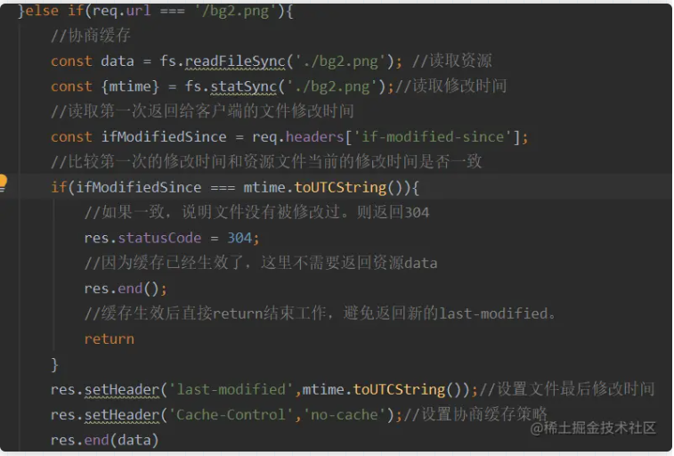
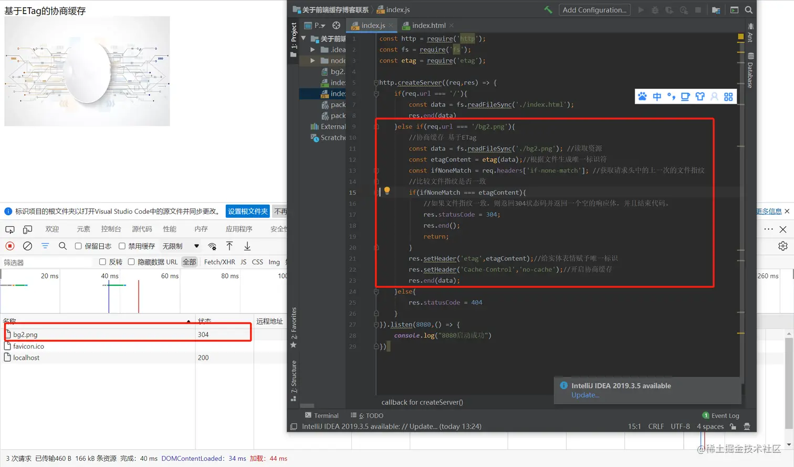

# [web 缓存](https://juejin.cn/post/7127194919235485733?searchId=20230926140004E95634F2CC90B41A86F7)

> Web 缓存是可以自动保存常见文档副本的 HTTP 设备。当 Web 请求抵达缓存时， 如果本地有“已缓存的”副本，就可以从本地存储设备而不是原始服务器中提取这 个文档

优点：

1. 减少不必要的网络传输
2. 更快的加载页面
3. 减少服务器压力

缺点：

1. 占用内存

## 强制缓存

> 如果浏览器判断请求的目标资源命中强缓存，则直接从内存中拿去，无需与服务器做任何通讯

### 基于` Expires`实现强缓存

**`Expires`过度依赖本地时间，如果本地与服务器时间不同步，就会出现资源无法被缓存或者资源永远被缓存的情况** ,**故而不被使用**

### 基于`Cache-control`实现强缓存

```js
//往响应头中写入需要缓存的时间
//从该资源第一次返回的时候开始，往后的10秒钟内如果该资源被再次请求，则从缓存中读取。
res.writeHead(200, {
	"Cache-Control": "max-age=10",
});
```

#### max-age / **s-maxage**

| **max-age**  | **表示的时间资源在客户端缓存的时长** |
| :----------: | :----------------------------------: |
| **s-maxage** |    **资源在代理服务端的缓存时长**    |

```js
//N就是需要缓存的秒数
//从第一次请求资源的时候开始，往后N秒内，资源若再次请求，则直接从磁盘（或内存中读取），不与服务器做任何交互
'Cache-Control':'max-age=N'
'Cache-Control':'s-maxage=N'
```

-   **s-maxage**代理服务端的缓存时长，必须和**public**属性一起使用
-   **max-age**和**s-maxage**并不互斥
-   **Cache-control:max-age=10000,s-maxage=200000,public**

#### **no_cache** / no-store

| **no_cache** |    强制进行协商缓存    |
| :----------: | :--------------------: |
| **no-store** | **禁止所有的缓存策略** |

-   当设置**no-cache** ,那么该资源会直接跳过强缓存的校验，直接去服务器进行协商缓存
-   **no-cache**和**no-store**是一组互斥属性

#### **public** / **private**

| **public**  |         资源在客户端和代理服务器都可以被缓存         |
| :---------: | :--------------------------------------------------: |
| **private** | **资源只能在客户端被缓存，拒绝资源在代理服务器缓存** |

-   默认 **private**
-   **public**和**private**是一组互斥属性

## 协商缓存

### 基于修改的协商缓存

1. **需要在服务器端读出文件修改时间**
2. **将读出来的修改时间赋给响应头的`last-modified`字段**
3. **设置`Cache-control:no-cache`**
4. **当客户端读取到`last-modified`的时候，会在下次的请求标头中携带一个字段:`If-Modified-Since` ( 服务器第一次修改时候给他的时间 )**
5. **之后每次对该资源的请求，都会带上`If-Modified-Since`这个字段，而服务器端就需要拿到这个时间并再次读取该资源的修改时间，让他们两个做一个比对来决定是读取缓存还是返回新的资源**



#### 缺点：

-   **因为是更具文件修改时间来判断的** , **在文件内容本身不修改的情况下** , **依然有可能更新文件修改时间（比如修改文件名再改回来）**
-   **当文件在极短时间内完成修改的时候（比如几百毫秒）。因为文件修改时间记录的最小单位是秒，所以，如果文件在几百毫秒内完成修改的话，文件修改时间不会改变**

### 基于 ETag 的协商缓存

> 将原先协商缓存的比较**时间戳**的形式修改成了比较文件**哈希值**



#### 缺点：

-   **ETag 需要计算哈希值这样意味着，服务端需要更多的计算开销，会影响服务器的性能**
-   **ETag 强验证的哈希值深入每个字节，可以保证文件内容的绝对不变，但是非常消耗计算量 **
-   **Etag 弱验证提取的是文件的部分属性，整体速度提升，但是准确率不高**

## 总结

1.  **关于强缓存，`cache-control`是`Expires`的完全替代方案**
2.  **关于协商缓存,`etag`是`last-modified`的补充方案， 具体用哪一个，取决于业务场景**
3.  **有哈希值的文件设置强缓存即可。没有哈希值的文件（比如 index.html）设置协商缓存**
4.  **所有带 304 的资源都是协商缓存，所有标注（从内存中读取/从磁盘中读取）的资源都是强缓存**
