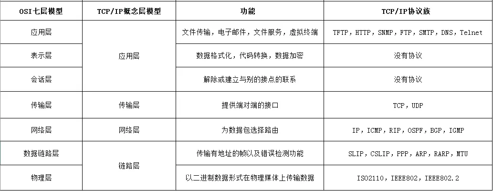

# TCP/IP 协议族

> TCP/IP 协议族是 Internet 最基本的协议，HTTP 协议是它的一个子集
>
> 按层次分为应用层、传输层、网络层、链路层
>
> TCP/IP 协议族内预存了各类通用的应用服务协议

## 概念模型

### 应用层

> **负责应用程序间的数据通讯的** 

#### FTP

> File Transfer Protocol，文件传输协议

-   通常把网页或程序传到 Web 服务器上，由于 FTP 传输效率非常高，传输大的文件时，一般也采用该协议。
-   FTP 协议默认使用 TCP 端口中的 20 和 21 这两个端口，20 用于传输数据，21 用于传输控制信息

#### [DNS](DNS.md)

> Domain Name System，域名系统
>
> **主机名转换成 IP 地址**

#### [HTTP](HTTP/HTTP.md)

> HyperText Transfer Protocol，超文本传输协议

* 采用了请求/响应模型 
*  定义了Web客户端如何从Web服务器请求Web页面，以及服务器如何把Web页面传送给客户端 

### 传输层

> 传输层对接上层应用层，提供处于网络连接中两台计算机之间的数据传输所使用的协议 
>
>  **负责两台主机间的数据传输的** 

#### [TCP](TCP.md)

> Transmission Control Protocol，传输控制协议 

*  TCP协议是全双工的，即发送数据和接收数据是同步进行的 
*  TCP协议在建立和断开连接时有三次握手和四次挥手, 因此传输的过程中更稳定可靠,但没UDP那么高效

#### UDP 

>  User Data Protocol，用户数据报协议 

* UDP协议是面向无连接的, 正式传递数据之前不需要先建立连接 
*  UDP 协议不保证有序且不丢失的传递到对端，但是不够稳定，因而UDP协议比TCP更加高效和轻便 
*  数据大小有限制（64k）

### 网络层

> 规定了数据通过怎样的传输路线到达对方计算机传送给对方 
>
>  **负责网络上的地址管理和路由选择的** 

#### [IP](IP.md)

>  指明了节点被分配到的地址，是网络层及其以上层使用的地址 

### 通信链路层

**细分为 `物理层` 和 `数据链路层`** 

#### 数据链路层

>  **负责设备之间的数据帧的传送和识别的** 

#### 物理层

> **负责将数据转换成信号，再将信号转换为数据的** 

## 处理过程

